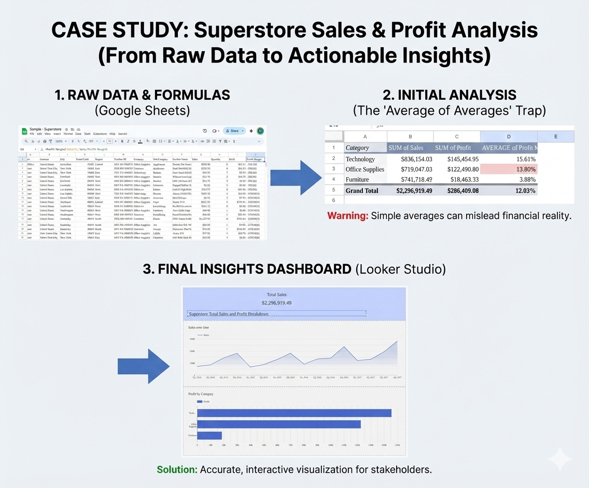

# 📊 Superstore Sales Analysis & Customer Segmentation

**Objective:**
To analyze sales data, correct financial inaccuracies often found in spreadsheet-only analysis, and identify high-value "VIP" customers using advanced segmentation.

**Tools Used:**

- **Analysis:** Python (Pandas, NumPy), Google Sheets, Excel.
- **Visualization:** Google Looker Studio.
- **Techniques:** Data Cleaning, Financial Modeling, RFM Analysis (Recency, Frequency, Monetary).

---

### 🔍 Phase 1: The "Excel Trap" (Descriptive Analysis)

Initially, I analyzed the data using Pivot Tables in Google Sheets. While effective for quick views, this highlighted a common financial error known as the **"Average of Averages."**

- **The Excel Calculation:** Averaging the profit margin of individual orders yielded a **15.61%** margin for Technology.
- **The Reality:** This approach treats a \$10 order the same as a \$5,000 order.
- **The Dashboard:** I built an interactive dashboard in Looker Studio to visualize these initial trends.
  

### 🐍 Phase 2: Python Correction (Financial Accuracy)

To fix the financial logic, I wrote a Python script (`analyze.py`) to calculate the **Weighted True Margin** (Total Profit / Total Sales).

- **Finding:** The _actual_ margin for Technology was **17.4%**, proving the Excel view was underreporting profitability by nearly 2%.
- **Scalability:** This Python pipeline can now process millions of rows without crashing, unlike the spreadsheet approach.

### 🎯 Phase 3: Diagnostic Analysis (Finding VIPs)

Moving beyond "what happened," I performed an **RFM Analysis** to find "Who are our best customers?"

- **Method:** Scored every customer on a 1-5 scale for **R**ecency, **F**requency, and **M**onetary value using `pd.qcut` (quantile segmentation).
- **Result:** Identified **30 VIP Customers** (Score 5-5-5) who represent the top tier of revenue and engagement.
- **Output:** Generated `vip_customers.csv` for the marketing team to target with exclusive offers.

---

**Files in this Repo:**

- `analyze.py`: Core logic for cleaning and margin calculation.
- `rfm_analysis.py`: Advanced customer segmentation script.
- `final_report.csv`: corrected financial data.
- `vip_customers.csv`: List of top 30 clients.
