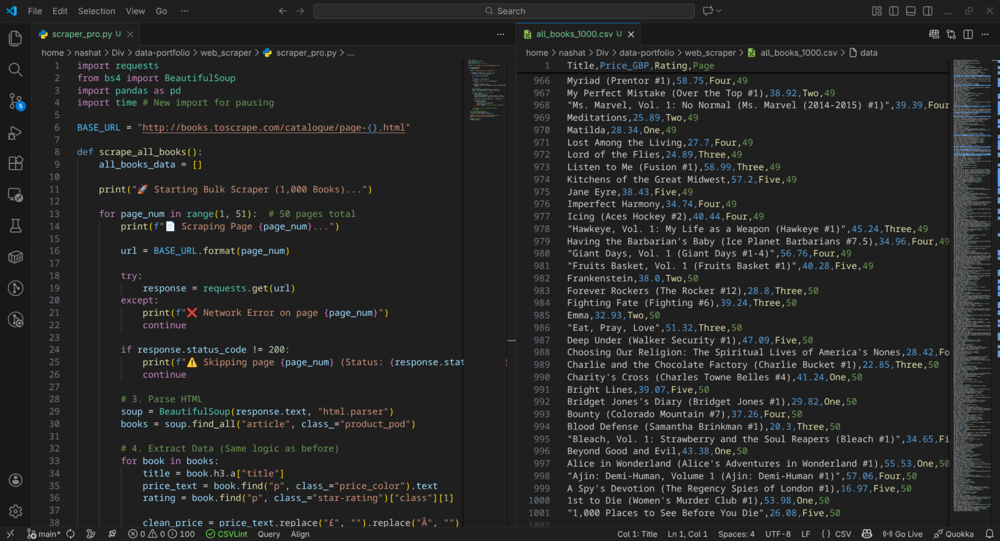

# 📊 Project 1: Superstore Sales Analysis & Customer Segmentation

**Objective:**
To analyze sales data, correct financial inaccuracies often found in spreadsheet-only analysis, and identify high-value "VIP" customers using advanced segmentation.

**Tools Used:**

- **Analysis:** Python (Pandas, NumPy), Google Sheets, Excel.
- **Visualization:** Google Looker Studio.
- **Techniques:** Data Cleaning, Financial Modeling, RFM Analysis (Recency, Frequency, Monetary).

---

### 🔍 Phase 1: The "Excel Trap" (Descriptive Analysis)

Initially, I analyzed the data using Pivot Tables in Google Sheets. While effective for quick views, this highlighted a common financial error known as the **"Average of Averages."**

- **The Excel Calculation:** Averaging the profit margin of individual orders yielded a **15.61%** margin for Technology.
- **The Reality:** This approach treats a \$10 order the same as a \$5,000 order.
- **The Dashboard:** I built an interactive dashboard in Looker Studio to visualize these initial trends.
  

### 🐍 Phase 2: Python Correction (Financial Accuracy)

To fix the financial logic, I wrote a Python script (`analyze.py`) to calculate the **Weighted True Margin** (Total Profit / Total Sales).

- **Finding:** The _actual_ margin for Technology was **17.4%**, proving the Excel view was underreporting profitability by nearly 2%.
- **Scalability:** This Python pipeline can now process millions of rows without crashing, unlike the spreadsheet approach.

### 🎯 Phase 3: Diagnostic Analysis (Finding VIPs)

Moving beyond "what happened," I performed an **RFM Analysis** to find "Who are our best customers?"

- **Method:** Scored every customer on a 1-5 scale for **R**ecency, **F**requency, and **M**onetary value using `pd.qcut` (quantile segmentation).
- **Result:** Identified **30 VIP Customers** (Score 5-5-5) who represent the top tier of revenue and engagement.
- **Output:** Generated `vip_customers.csv` for the marketing team to target with exclusive offers.

---

**Files in this Repo:**

- `analyze.py`: Core logic for cleaning and margin calculation.
- `rfm_analysis.py`: Advanced customer segmentation script.
- `final_report.csv`: corrected financial data.
- `vip_customers.csv`: List of top 30 clients.

## 🕷️ Project 2: Bulk Web Scraper (Automated Data Extraction)

**Objective:**
To build a robust, automated data pipeline that extracts large-scale product data from a multi-page e-commerce website ("Books to Scrape") for market analysis.

**Tools Used:**

- **Language:** Python 3.12
- **Libraries:** `BeautifulSoup` (Parsing), `Requests` (HTTP), `Pandas` (CSV Export), `Time` (Rate Limiting).
- **Environment:** Fedora Linux (Virtual Env).

**Key Technical Features:**

- **Pagination Logic:** The script automatically loops through all 50 pages of the catalogue to ensure 100% data capture (1,000 items).
- **Data Cleaning Pipeline:** Currency symbols (`£`) and encoding artifacts (`Â`) are stripped programmatically during extraction, not after.
- **Ethical Scraping:** Implemented `time.sleep(1)` delays between requests to prevent server overload and mimic human behavior.
- **Error Handling:** Includes status code checks to skip broken pages without crashing the scraper.

**Outcome:**
Generated a clean, 1,000-row dataset (`all_books_1000.csv`) ready for immediate pricing analysis.

**Code Snippet & Output:**


**Files in this Module:**

- `scraper_pro.py`: The production-grade script with pagination loops.
- `all_books_1000.csv`: The final output dataset.

## 🚀 Project 3: AI Book Scraper App (Streamlit Web Interface)

**Objective:**
To transform the "Book Scraper" script into a user-friendly Web Application, allowing non-technical users to trigger data extraction and download results without touching a terminal.

**Tools Used:**

- **Framework:** `Streamlit` (Python-based Frontend).
- **Backend:** `Requests`, `BeautifulSoup`.
- **Deployment:** Streamlit Cloud (Live on the Internet).

**Key Features:**

- **Interactive UI:** Users can select the number of pages (1-50) using a simple slider.
- **Real-Time Feedback:** Displays a live progress bar and status updates (`"Scraping page 3 of 10..."`) so users aren't left guessing.
- **One-Click Export:** Generates a clean CSV file and provides a dedicated "Download" button.
- **Error Handling:** Visual error messages in the UI if the target site is down.

**Live Demo:**
[👉 Click here to test the App](https://data-portfolio-book-scrapper.streamlit.app/)
_(Note: Replace the link above with your actual Streamlit URL)_

**Code Snippet:**

```python
# The "Download" Button Logic
csv = df.to_csv(index=False).encode('utf-8')
st.download_button(
    label="📥 Download Data as CSV",
    data=csv,
    file_name="scraped_books.csv",
    mime="text/csv"
)
```

## 🗄️ Project 4: SQL Data Pipeline (ETL)

**Objective:**
To upgrade the data storage from flat files (CSV) to a structured **Relational Database (SQLite)**. This allows for advanced querying, better data integrity, and scalability for larger datasets.

**Tools Used:**

- **Database:** SQLite (Lightweight, Serverless).
- **Language:** SQL (Structured Query Language).
- **Integration:** Python `sqlite3` module.

**Key Technical Features:**

- **Automated Schema Creation:** The script checks if the database exists and creates the table structure (`CREATE TABLE IF NOT EXISTS`) automatically.
- **ETL Pipeline:** Extracted data from the web, Transformed the price strings into numbers, and Loaded it into the database (`INSERT INTO`).
- **Transactional Integrity:** Uses `conn.commit()` to ensure data is safely saved after processing each page.

**SQL Query Example:**
_Finding the top 5 most expensive books in the database:_

```sql
SELECT title, price FROM books ORDER BY price DESC LIMIT 5;
```

---

## 🤖 Project 5: AI Salary Predictor (Machine Learning)

**Objective:**
To build and deploy a Machine Learning model that predicts salary based on years of experience, demonstrating the end-to-end AI lifecycle from training to deployment.

**Tools Used:**

- **Library:** `Scikit-Learn` (Linear & Polynomial Regression).
- **Persistence:** `Joblib` (Model saving/loading).
- **Visualization:** `Matplotlib` (Dynamic plotting).
- **Frontend:** `Streamlit`.

**Key Features:**

- **Polynomial Regression:** Uses a Degree-2 polynomial to capture non-linear growth patterns (avoiding underfitting).
- **Interactive Predictions:** Users can adjust input parameters via a slider to get real-time estimates.
- **Dynamic Visualization:** The app plots the user's input directly onto the regression curve to explain the "Why" behind the prediction.

**Live Demo:**
[👉 Click here to test the AI Model](https://salary-prediction-model-ai.streamlit.app/)

# 📚 Project 6: Automated Book Price Tracker

## 📌 Project Overview

This project is an automated ETL (Extract, Transform, Load) pipeline designed to monitor book prices and availability over time. It scrapes data daily from a target bookstore, timestamps the entries, and stores them in a relational database (SQLite) to enable historical price analysis and trend tracking.

This tool was built to demonstrate **backend automation**, **database management**, and **robust error handling** in a Linux environment.

## 🚀 Key Features

- **Automated Data Collection:** Runs autonomously via Linux Cron jobs to collect data every day at a specific hour.
- **Historical Tracking:** Implements SCD (Slowly Changing Dimensions) Type 2 logic by timestamping every entry (`scraped_at`), allowing for time-series analysis of price changes.
- **Robust Logging:** Generates `scraper_log.txt` to track execution status, capturing errors (e.g., connection timeouts) without crashing the pipeline.
- **Duplicate Handling:** Custom SQL logic ensures data integrity while preserving historical context.

## 🛠️ Tech Stack

- **Language:** Python 3.x
- **Database:** SQLite3
- **Automation:** Bash & Cron (Linux Task Scheduler)
- **Libraries:** `sqlite3`, `datetime`, `logging`, `os` (plus your scraping libraries like `requests`/`BeautifulSoup` or `Selenium`)

## 📂 Project Structure

```text
├── scraper_sql.py      # Main ETL script (Extracts data, Transforms with timestamp, Loads to DB)
├── library.db          # SQLite database storing the book data
├── scraper_log.txt     # Log file for monitoring system health
├── requirements.txt    # Python dependencies
└── README.md           # Project documentation
```
