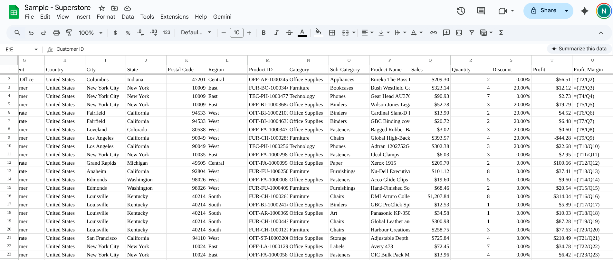

## Project 1: Superstore Sales Analysis

**Objective:** Analyzed sales data to identify profit margins across categories.
**Tools:** Google Sheets, Pivot Tables.

**Key Findings:**

- **Technology** is the most profitable category with a **15.61%** margin.
- **Binders** is the most non profitable subcategory with **-19.96%** margin.

**Visuals:**
# data-portfolio
# data-portfolio
# data-portfolio
# data-portfolio
